# Summary
>On this page, I'm going to summarize what I learned from _Learn SQL_ Book.

## Why we use SQL?
SQL is used to **communicate with a database**.
<hr>

## Lesson 1 
_SQL SELECT_
>The SELECT statement is used to select data from a database.

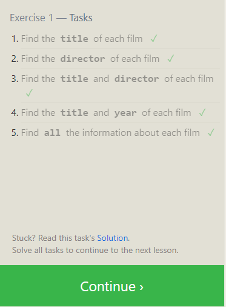

```
SELECT title FROM movies;  
SELECT director FROM movies;   
SELECT title, director FROM movies;  
SELECT title, year FROM movies;  
SELECT * FROM movies;
```
<hr>

## Lesson 2 
_Queries with constraints(Pt. 1)_
>SQL constraints are used to specify rules for data in a table.

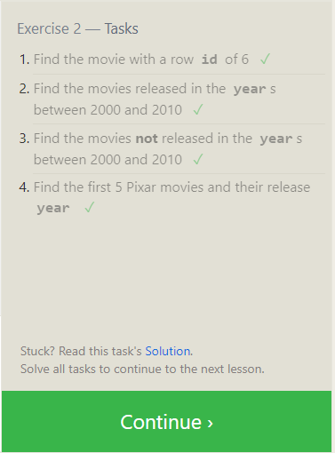

```
SELECT * FROM Movies WHERE ID = 6;
SELECT * FROM Movies WHERE Year BETWEEN 2000 AND 2010;  
SELECT * FROM Movies WHERE Year NOT BETWEEN 2000 AND 2010;  
SELECT title, year FROM movies WHERE year >= 2000; 
```
<hr>

## Lesson 3 
_Queries with constraints(Pt. 2)_
>SQL constraints are used to specify rules for data in a table.

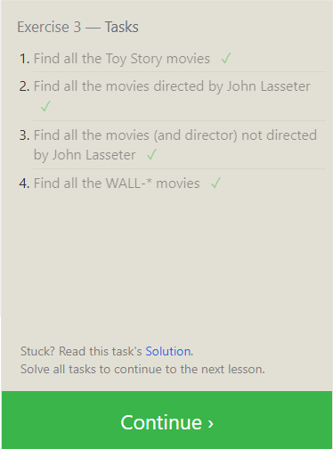

```
SELECT * FROM movies WHERE title LIKE"%Toy Story%";
SELECT * FROM movies WHERE director LIKE"%John Lasseter%";
SELECT * FROM movies WHERE director NOT LIKE"%John Lasseter%";
SELECT * FROM movies WHERE title LIKE "WALL-%"
```

## Lesson 4 
_Filtering and sorting Query results_
>It used to sort the data

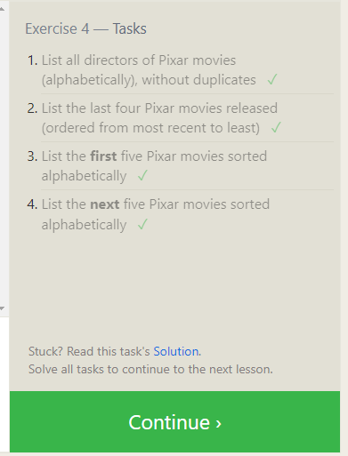

```
SELECT DISTINCT director FROM movies ORDER BY director ASC;
SELECT * FROM movies ORDER BY year DESC LIMIT 4;
SELECT * FROM movies ORDER BY Title ASC LIMIT 5;
SELECT Title FROM movies ORDER BY Title ASC LIMIT 5 OFFSET 5;
```

## SQL Review 
_Simple SELECT Queries_

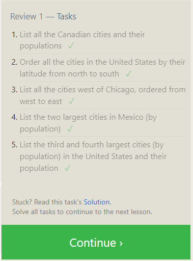

```

SELECT * FROM north_american_cities WHERE Country Like "Canada" ;
SELECT * FROM north_american_cities WHERE Country Like "United States" ORDER BY Latitude DESC;
SELECT city, longitude FROM north_american_cities
    WHERE longitude < -87.629798
ORDER BY longitude ASC; 
SELECT city FROM north_american_cities WHERE Country="Mexico" ORDER BY population DESC LIMIT 2;
SELECT city,population FROM north_american_cities WHERE Country="United States" ORDER BY population DESC LIMIT 2 OFFSET 2;
```

## Lesson 6 
_Multi-table queries with JOINs_
>It used to get something meaningful out of data

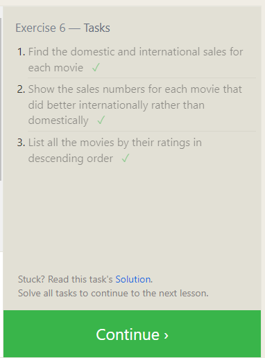

```

SELECT title, domestic_sales, international_sales 
FROM movies
  JOIN boxoffice
    ON movies.id = boxoffice.movie_id;  

SELECT title, domestic_sales, international_sales
FROM movies
  JOIN boxoffice
    ON movies.id = boxoffice.movie_id
WHERE international_sales > domestic_sales;  

SELECT title, rating
FROM movies
  JOIN boxoffice
    ON movies.id = boxoffice.movie_id
ORDER BY rating DESC;  

```

## Lesson 13 
_Inserting rows_
>Is used to insert new records in a table.

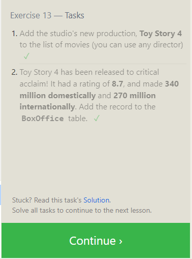

```
INSERT INTO movies (title, director, year, length_minutes)
	VALUES ('Toy Story 4','John Lasseter',2022,120);

INSERT INTO Boxoffice (Movie_id, Rating, Domestic_sales, International_sales)
	VALUES (15,8.7,340000000,270000000);
```

## Lesson 14 
_Updating rows_
>The UPDATE statement is used to modify the existing records in a table.

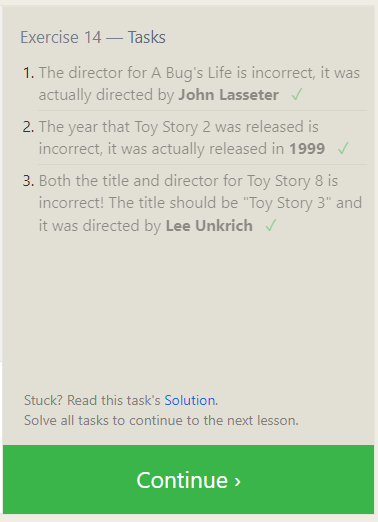

```
UPDATE Movies SET Director ='John Lasseter' WHERE title = "A Bug's Life";

UPDATE Movies SET Year = 1999 WHERE title = "Toy Story 2";

UPDATE Movies SET title = 'Toy Story 3', Director = 'Lee Unkrich' WHERE title ='Toy Story 8';
```

## Lesson 15 
_Deleting rows_
>The DELETE statement is used to delete existing records in a table.

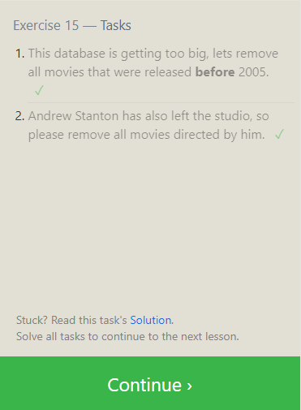

```
DELETE FROM Movies WHERE Year < 2005;

DELETE FROM Movies WHERE Director = 'Andrew Stanton';
```

## Lesson 16 
_Creating tables_
>The CREATE TABLE statement is used to create a new table in a database.

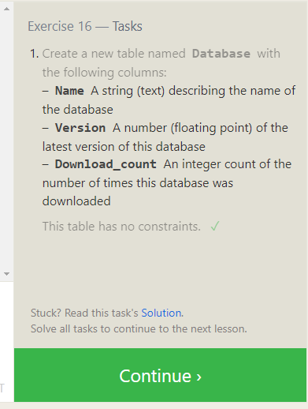

```
CREATE TABLE Database(
	Name TEXT,
	Version FLOAT,
	Download_count INTEGER
	);
```
## Lesson 17
_Altering tables_
>The ALTER TABLE statement is used to add, delete, or modify columns in an existing table and is also used to add and drop various constraints on an existing table.

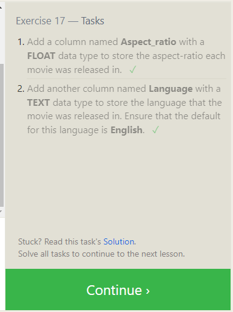

```
ALTER TABLE movies ADD aspect_ratio FLOAT;
ALTER TABLE movies ADD language TEXT DEFAULT "English";
```

## Lesson 18
_Dropping tables_
>The DROP TABLE statement is used to drop an existing table in a database.

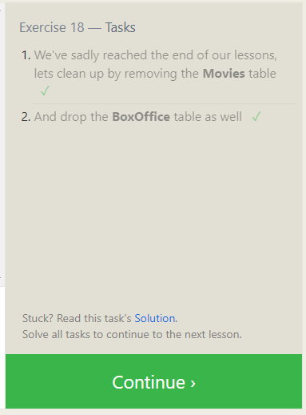

```
DROP TABLE IF EXISTS movies;
DROP TABLE IF EXISTS boxoffice;
```